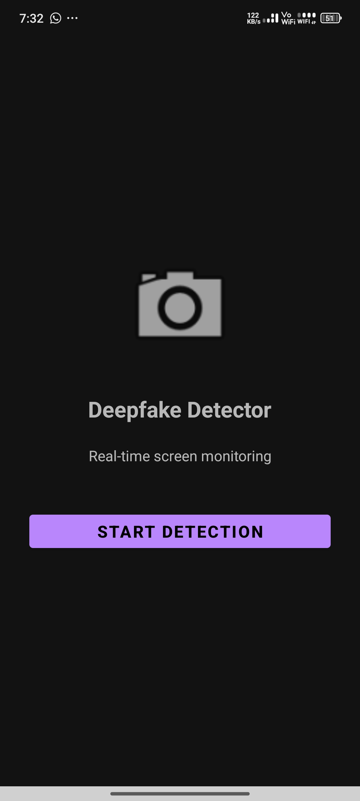
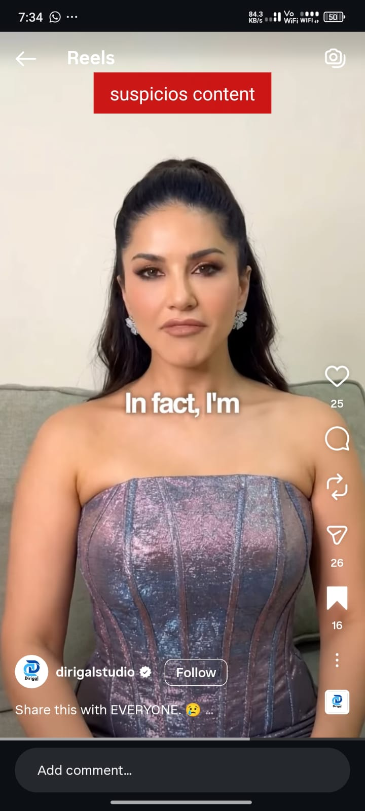
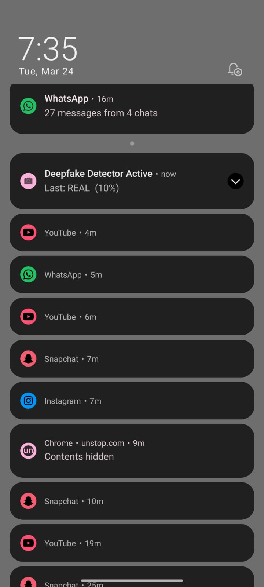

<div align="center">

# 🛡️ DeepfakeDetector

### Real-Time, On-Device Deepfake Detection for Android

[](https://www.android.com/)
[](https://kotlinlang.org/)
[](https://www.tensorflow.org/lite)
[](#-license)
[](#-academic-project)

*A lightweight, privacy-first Android application that detects AI-generated or manipulated facial content in real time — directly on your device, with no cloud processing.*

[Features](#-features) • [Architecture](#%EF%B8%8F-system-architecture) • [Installation](#-installation) • [Download](#-download) • [Team](#-team) • [License](#-license)

</div>

---

## 📌 Project Overview

Deepfake technology has become increasingly sophisticated, making it difficult to distinguish authentic content from AI-generated manipulation. **DeepfakeDetector** addresses this by continuously analyzing on-screen content — reels, shorts, images, and videos — and flagging manipulated faces the moment they appear, without ever sending data off the device.

Instead of requiring a user to manually upload a photo or video for analysis, the app watches the screen the way a person already does: passively, while scrolling through normal content. It captures the visible frame, finds any faces, runs them through an on-device model, and raises an alert immediately if something looks synthetic.

> Most existing deepfake detectors follow an *upload → server processing → result* pipeline. DeepfakeDetector flips this into *watch normally → automatic detection → instant warning*, entirely on-device.

## 🎯 Objectives

- Detect deepfake content in real time, as it's being viewed
- Reduce the spread of misinformation and digital fraud
- Provide on-device inference with zero cloud dependency
- Preserve user privacy — nothing is uploaded, stored, or shared
- Stay lightweight and fast enough for everyday mobile use

---

## ✨ Features

### 🔍 Real-Time Screen Monitoring
Continuously monitors the screen once permission is granted, using Android's `MediaProjection` API to capture frames at regular intervals (roughly every 2–3 seconds) and analyze only the content currently visible — no manual upload required. This means it works passively while watching reels, shorts, social posts, or any on-screen video or image.

### 🧵 Background Detection Service
Runs as a foreground/background service so detection continues even after the user switches to another app. Tap **Start Detection** once, and protection persists in the background until **Stop Detection** is pressed — no need to keep the app open.

### 👤 Face Detection (ML Kit)
Before any deepfake analysis happens, Google's ML Kit locates and crops faces from each captured frame, so only the relevant face region — not the entire screenshot — is passed to the model. This keeps inference fast, reduces battery drain, and improves accuracy by removing irrelevant background pixels.

### 🤖 AI-Based Deepfake Classification
The cropped face image is passed to a TensorFlow Lite model trained on real and fake facial data, which analyzes facial patterns and textures to classify the content as **Real** or **Fake** — entirely on-device, with no internet connection required.

### 🔄 Scroll Detection & Smart Frame Analysis
One of the more distinctive features: the app compares consecutive screenshots to detect when the user has scrolled, swiped, or switched to new content. Without this, a slow-finishing prediction on an old frame could trigger an alert *after* the user has already moved to different (real) content — a confusing false positive. Scroll detection invalidates stale frames so a finished prediction is only ever shown against the content it was actually computed from. This is what makes the app usable across fast-feed platforms like Reels, Shorts, and TikTok-style scrolling, rather than just static images.

### ⚡ Smart Frame Skipping
Rather than analyzing every single frame, the app captures at intervals and skips duplicate or near-identical frames, processing only meaningful changes. This conserves battery and CPU while keeping detection responsive.

### 🚨 Instant Warning Notifications
When manipulated content is detected, the user is alerted immediately via a toast message, overlay warning, or system notification — for example:

> ⚠️ **Suspicious Content**
> This content may be AI-generated or manipulated.

### 📊 Live Confidence Score
Rather than a flat yes/no verdict, the model surfaces a probability breakdown (e.g., *Real: 12% / Fake: 88%*), giving the user transparency into how confident the prediction actually is.

### 🎚️ False Positive Reduction
A single uncertain prediction doesn't trigger a warning on its own. The app combines a confidence threshold, multi-frame verification, face quality checks, and scroll detection together to cut down on spurious alerts and keep results trustworthy.

### 📱 Multi-App Compatibility
Designed to work across the apps people actually use day to day:

| Platform | Content Type |
|---|---|
| Instagram | Reels, posts |
| YouTube | Shorts, videos |
| Facebook | Videos, posts |
| WhatsApp | Shared images |
| Browser | Embedded video/images |
| Gallery | Local photos |

### 🔒 Fully Offline, Privacy-First Architecture
All analysis — capture, detection, and classification — happens locally on the device:

- ✅ No cloud processing
- ✅ No server uploads
- ✅ No permanent image storage
- ✅ No data sharing of any kind

### 🪶 Lightweight TensorFlow Lite Model
The trained model is converted to `model.tflite`, dramatically cutting memory footprint, storage size, and inference latency compared to a full TensorFlow model — making it practical to run continuously on a phone.

### 🔋 Battery-Optimized Detection
Achieved through frame interval sampling, face-only (not full-frame) analysis, TFLite's efficient inference engine, and smart frame skipping — together allowing long-running background monitoring without draining the battery.

---

## 🏗️ System Architecture

```
                    User Screen
                         │
                         ▼
                MediaProjection API
                         │
                         ▼
               Frame Capture Module
                         │
                         ▼
              Scroll / Change Detection ───► (stale frame discarded)
                         │
                         ▼
               ML Kit Face Detection
                         │
                         ▼
                  Face Extraction
                         │
                         ▼
              TensorFlow Lite Model
                         │
                         ▼
                     Prediction
                         │
                 ┌───────┴───────┐
                 │               │
               Real           Deepfake
                 │               │
                 ▼               ▼
             No Alert    Warning Notification
```

### 🔄 Workflow

1. User starts the Deepfake Detector service.
2. `MediaProjection` API captures screen frames periodically.
3. Scroll/change detection discards frames invalidated by scrolling or swiping.
4. Valid frames are processed using ML Kit Face Detection.
5. Detected faces are cropped and preprocessed.
6. The TensorFlow Lite model performs inference.
7. A prediction is generated — **Real** or **Deepfake** — with a confidence score.
8. If deepfake content is detected, an alert is displayed and the user is notified immediately.
9. The process repeats continuously until the service is stopped.

---

## 🛠️ Technologies Used

<table>
<tr>
<td valign="top" width="50%">

**Frontend**
- XML Layouts
- Material Design Components

**Backend**
- Kotlin
- Android SDK

**Machine Learning**
- TensorFlow Lite
- TensorFlow
- MobileNetV2 / CNN-based model

</td>
<td valign="top" width="50%">

**Computer Vision**
- Google ML Kit (Face Detection)

**Android APIs**
- MediaProjection API
- Foreground Service
- Accessibility Service
- Notification Manager

**Development Tools**
- Android Studio
- Git & GitHub

</td>
</tr>
</table>

---

## 📂 Project Structure

```
DeepfakeDetector/
│
├── app/
│   ├── src/
│   │   ├── main/
│   │   │   ├── java/
│   │   │   │   ├── activities/
│   │   │   │   ├── services/
│   │   │   │   ├── detector/
│   │   │   │   ├── utils/
│   │   │   │   └── ml/
│   │   │   │
│   │   │   ├── res/
│   │   │   └── AndroidManifest.xml
│
├── gradle/
├── build.gradle.kts
├── settings.gradle.kts
└── README.md
```

---

## 🧠 Machine Learning Model

**Model type:** TensorFlow Lite deep learning model (MobileNetV2 / CNN-based)

**Training data:** A combination of real and deepfake facial images, drawn from datasets such as:

- FaceForensics++
- Celeb-DF
- DeepFake Detection Challenge Dataset (DFDC)

**Preprocessing pipeline:** Face detection → face cropping → image resizing → pixel normalization

**Classification pipeline:**

```
Input Face Image
      │
      ▼
Feature Extraction
      │
      ▼
Deep Learning Model
      │
      ▼
Probability Score
      │
 ┌────┴────┐
 │         │
Real   Deepfake
```

---

## 📊 Performance

| Metric | Value |
|---|---|
| Accuracy | ~90%+ |
| Platform | Android |
| Inference | On-device |
| Processing | Real-time |
| Framework | TensorFlow Lite |

> **Note:** Actual accuracy may vary depending on the training dataset, lighting conditions, and device specifications.

---

## 📸 Screenshots

<div align="center">

| Home Screen | Detection Result | Alert Screen |
|---|---|---|
|  |  |  |

</div>


## 🚀 Installation

### Prerequisites

- Android Studio (latest stable version)
- Android SDK
- Kotlin plugin
- A physical Android device or emulator (Android 8.0+ recommended for `MediaProjection` support)

### Steps

**1. Clone the repository**

```bash
git clone https://github.com/yourusername/DeepfakeDetector.git
```

**2. Open in Android Studio**

```
Android Studio → Open Existing Project → Select DeepfakeDetector Folder
```

**3. Build the project**

```
Sync Gradle → Build Project
```

**4. Run on a device**

Connect an Android device (or start an emulator) and hit **Run**.

---


## 📱 Usage

1. Launch the application.
2. Grant the required permissions (screen capture, notifications).
3. Tap **Start Detection**.
4. Open videos, reels, images, or social media content as you normally would.
5. The app analyzes any visible faces in the background.
6. If manipulated content is detected, a warning is displayed instantly.
7. Tap **Stop Detection** to end monitoring.

---

## 🔒 Privacy & Security

- No cloud processing of any kind
- No personal data storage
- No image or screenshot uploads
- The entire detection pipeline runs locally on-device
- User content never leaves the phone

---

## 🔮 Future Enhancements

- [ ] Video-level (temporal) deepfake analysis, not just per-frame
- [ ] Audio deepfake detection
- [ ] Transformer-based detection models
- [ ] Higher detection accuracy across diverse datasets
- [ ] Support for multiple simultaneous faces in-frame
- [ ] Explainable AI (XAI) visualization of model decisions
- [ ] Cloud-assisted, opt-in model updates

---

## 🎓 Academic Project

This project was developed as a **Final Year B.Tech Project**, with the goal of combating misinformation and improving digital content authenticity through AI-powered, on-device deepfake detection.

---

## 👥 Team

This project was built collaboratively by a team of four. Replace the placeholder usernames below with each teammate's actual GitHub handle.

| Name | Role | GitHub |
|---|---|---|
| Sachin S Kumar | Android Development, ML Integration | [@sachinskumar2004](https://github.com/sachinskumar2004) |
| Teammate 2 Name | *e.g. ML Model Training* | [@github-username](https://github.com/github-username) |
| Teammate 3 Name | *e.g. UI/UX Design* | [@github-username](https://github.com/github-username) |
| Teammate 4 Name | *e.g. Backend / Testing* | [@github-username](https://github.com/github-username) |

> **How GitHub linking actually works:** GitHub doesn't have a single button that "links" four people's profiles to one repo as a unit — but here's what does work, and you can use both together:
>
> 1. **README Contributors table (above)** — purely cosmetic, but the most visible to anyone reading the repo. Just swap in real usernames and names.
> 2. **The repo's own Contributors graph** — this is auto-generated by GitHub and only populates when someone has actually authored a commit in the repo's history (visible under the **Insights → Contributors** tab). If your teammates only handed you their code and you committed it all yourself, they won't show up here even if they're listed in the README.
>
> If you want them to show up in the *real* GitHub contributor graph (recommended for a group project, since it's evidence of who actually contributed), either:
> - Add them as **collaborators** (repo → Settings → Collaborators → add by username) so they can push commits directly under their own account, or
> - If you already have their code, you can credit their authorship on the commits using `git commit --author="Name <email>"` when you commit their parts, so the commit history reflects who wrote what even though you pushed it.

---

## 📜 License

This project is licensed under the **MIT License**.

```
MIT License

Copyright (c) 2026 Sachin S Kumar

Permission is hereby granted, free of charge, to any person obtaining a copy
of this software and associated documentation files (the "Software"), to deal
in the Software without restriction, including without limitation the rights
to use, copy, modify, merge, publish, distribute, sublicense, and/or sell
copies of the Software, subject to the following conditions:

The above copyright notice and this permission notice shall be included in
all copies or substantial portions of the Software.

THE SOFTWARE IS PROVIDED "AS IS", WITHOUT WARRANTY OF ANY KIND, EXPRESS OR
IMPLIED, INCLUDING BUT NOT LIMITED TO THE WARRANTIES OF MERCHANTABILITY,
FITNESS FOR A PARTICULAR PURPOSE AND NONINFRINGEMENT.
```

---

<div align="center">

### ⭐ If you found this project useful, consider giving it a star on GitHub!

</div>
